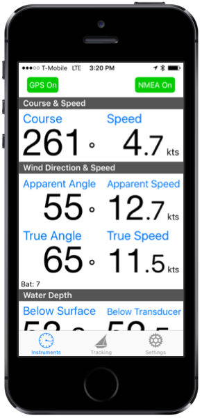

Sail Buddy is a light-weight sailing app designed to do a few things well. When it comes to sailing I'm mostly a day sailer or a cruiser.
I wanted a light-weight app that would show course, speed, and wind data from my [SailTimer wind vane][sailtimer]
without a lot of fuss, and without tripping around other features which 90% of the time I don't use or want.

 
{: .watches :}

Sail Buddy is *not* a navigation app. There are [many][ex1] [other][ex2] [apps][ex3] that are better at navigation than Sail Buddy could ever be.
No sense reinventing the wheel.

Here's what Sail Buddy does:

* Displays course and speed in a large, easily read display
* Displays NMEA data the same way: TCP and UDP connections are supported---[More on that later](#nmea)
* Route tracking with full capture of GPS and NMEA data (a feature I couldn't find in other apps). Saved trips can be viewed on
  a map or exported in CSV, KML (for Google maps), XML or GeoJSON formats
* iPhone, iPad and Apple Watch are all supported (Android is not, sorry)

### Tell me what you think! ###

This is early software with lots of room for new ideas. I am very interested in making it more
useful so long as I can keep it fast and light. If you have ideas or are experiencing issues, please [contact me][contact].

### NMEA Operation ### {#nmea}

Sail Buddy can read and display instrument data transmitted in [NMEA 0183 format][nmea] over a TCP or UDP connection. Typically, you would
connect to a multiplexer such as the [Brookhouse iMux][imux] or another device like the [SailTimer wind vane][sailtimer] that creates its own
wifi network. To get connected:

1. Go to iPhone settings and choose the wifi network created by your hardware
2. Tap the Settings icon in Sail Buddy and enter the network settings for your hardware
3. Tap the NMEA button in Sail Buddy's Instruments tab 

Sail Buddy supports the following NMEA sentences:

Category | Identifier | Definition
----     | ---------- | ----------
Wind     | $WIMWV     | Speed and velocity
Wind     | $WIBAT     | Battery level (for [SailTimer wind vane][sailtimer])
Depth    | $SDDBT     | Depth below transducer
Depth    | $SDDBK     | Depth below keel
Depth    | $SDDBS     | Depth below surface
Depth    | $SDDPT     | Depth (below surface or keel)

GPS sentences such as $GPGGA are not directly supported since Sail Buddy gets GPS information directly from the Location Services built into
your iOS device.

If your device is not supported, please [contact me][contact] and we can try to work something out.

**Note:** NMEA mode works best if GPS mode is also enabled. Otherwise, data may not be monitored correctly if the app is running in the background.
Also be sure to enable "Background Location Services" in your iOS settings.

### Apple Watch ### {#watch}

{: .sidebar-image :}

Sail Buddy for Apple Watch displays the same information as the iOS app. Swipe left or right to switch between information types.

You can also control Sail Buddy via the watch, for instance, start/stop route tracking. Force-press the display to access the menu.

### Contact Information ### {#contact}

* [Send me an email][contact]
* [Find me on Twitter](http:/twitter.com.tgherzog)

[sailtimer]: http://sailtimerwindvane.com
[imux]:      http://brookhouseonline.com/imux.htm
[nmea]:      https://en.wikipedia.org/wiki/NMEA_0183
[contact]:   mailto:sailbuddyapp@gmail.com

[ex1]: https://itunes.apple.com/us/app/inavx-marine-navigation-noaa/id286616280?mt=8
[ex2]: https://itunes.apple.com/us/app/aqua-map-usa-pro-marine-gps/id700695449?mt=8
[ex3]: https://itunes.apple.com/us/app/i-boating-gps-nautical-marine/id994992062?mt=8

