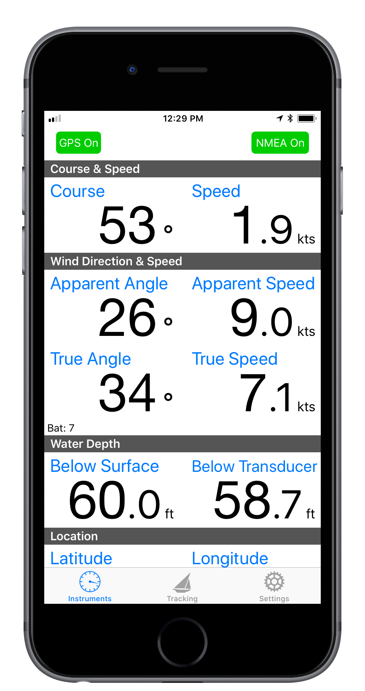
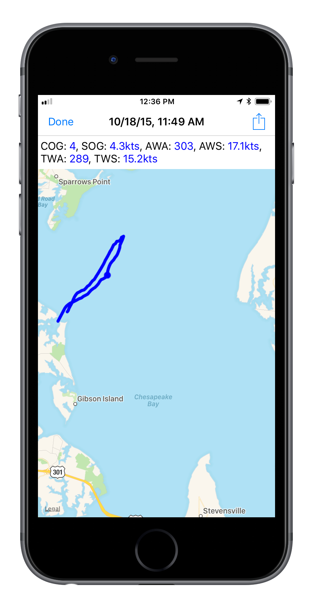
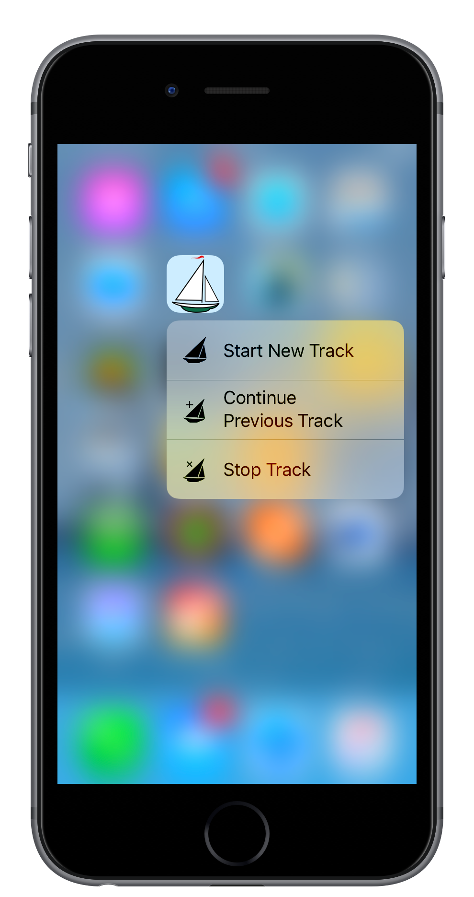
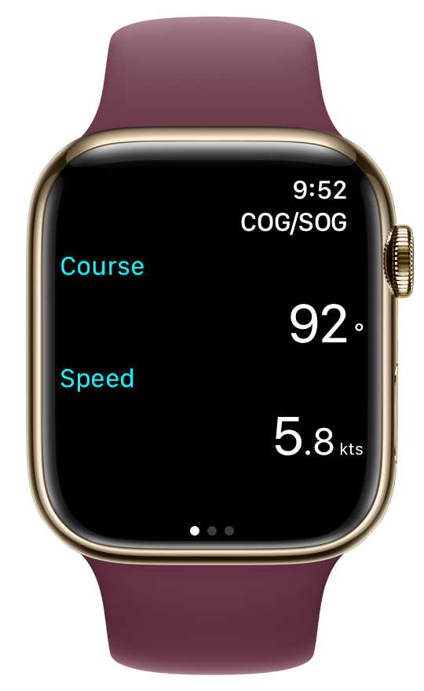
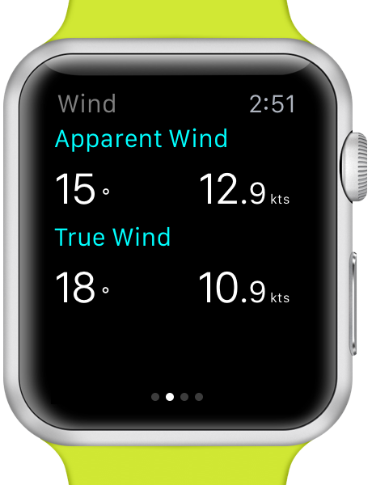
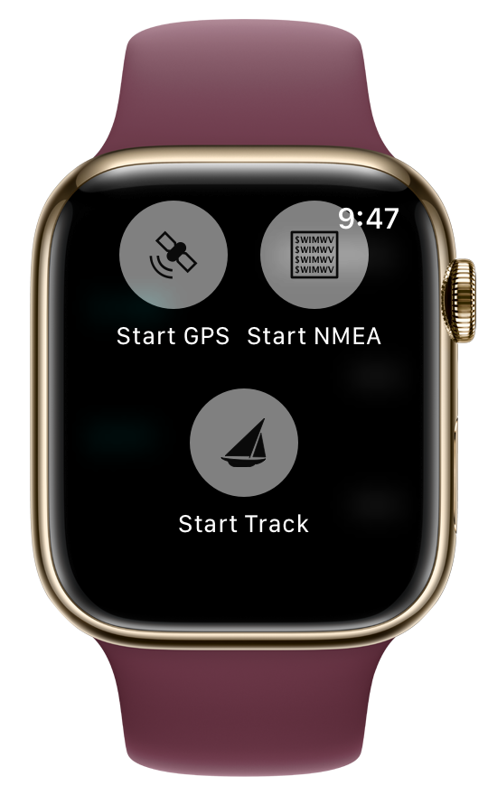

Sail Buddy is a light-weight sailing app designed to do a few things well. When it comes to sailing I'm mostly a day sailer or a cruiser.
I wanted a light-weight app that would show course, speed, and wind data from my [SailTimer wind instrument][sailtimer2]
without a lot of fuss, and without tripping around other features which 90% of the time I don't use or want.

[][store]
{: .app-store :}

Large, easy to read format

Display recorded data via maps

Shortcuts for fast operation

 

Full iWatch support

Sail Buddy is *not* a navigation app. There are [many][ex1] [other][ex2] [apps][ex3] that are better at navigation than Sail Buddy could ever be.
No sense reinventing the wheel.

Here's what Sail Buddy does:

* Displays course and speed in a large, easily read display
* Displays [NMEA data](#nmea) the same way: TCP and UDP connections are supported
* Route tracking with full capture of GPS and NMEA data (a feature I couldn't find in other apps). Saved trips can be viewed on
  a map or exported in CSV, KML (for Google maps), GPX/XML, JSON or GeoJSON formats
* Saved trips can be transferred between iOS devices that support AirDrop. Click the Share icon and choose "JSON (native)" format to transfer the trip
  to Sail Buddy running on a different device. This feature is nice for sharing trips with a friend, or viewing a trip on an iPad or larger display.
* iPhone, iPad and Apple Watch are all supported (Android is not, sorry)

### Tell me what you think! ###

This is early software with lots of room for new ideas. I am very interested in making it more
useful so long as I can keep it fast and light. If you have ideas or are experiencing issues, please [contact me][contact].

### NMEA Operation ### {#nmea}

Sail Buddy can read and display instrument data transmitted in [NMEA 0183 format][nmea] over a TCP or UDP connection. Here are some typical setups:

#### WiFi ####

WiFi-based hardware such as the
[Brookhouse iMux][imux] multiplexer, the [SailTimer AirLink][airlink]  or the
[SailTimer wind vane][sailtimer1] (discontinued in 2013) create their own WiFi networks.

1. Go to iPhone settings and choose the wifi network created by your hardware
2. Tap the Settings icon in Sail Buddy, then tap the **NMEA Configuration** button and enter the network settings for your hardware
3. Also enable the appropriate options under Hardware Support for your hardware
4. Tap the NMEA button in Sail Buddy's Instruments tab

##### SailTimer Wind Instrument #####

The [SailTimer wind instrument][sailtimer2] connects directly to your iPhone via [Bluetooth][bt] using a custom app.

1. Download the [SailTimer API][stapi] from the App Store
2. Launch the SailTimer API, connect to the wind instrument, and confirm it is receiving data
3. Launch Sail Buddy, tap the Settings icon, then tap the **NMEA Configuration** button and enter these settings:
   * Connection Type: **UDP**
   * Port: **55554**
   * Displayed Data Types: **Wind Speed & Direction**
   * Hardware Support: **SailTimer Wind Instrument**
4. Tap the NMEA button in Sail Buddy's Instruments tab

Sail Buddy supports the following NMEA sentences:

Category | Identifier | Definition
----     | ---------- | ----------
Location | ??GGA      | GPS Location (if location source is set to "NMEA Data")
Location | ??RMC      | Recommended Minimum Navigation Information (if location source is set to "NMEA Data")
Wind     | ??MWV      | Speed and direction
Wind     | ??MWD      | Speed and direction (relative to true and magnetic north)
Wind     | PSTW       | Speed and direction (relative to current heading). See [SailTimer wind instrument][sailtimer2]
Wind     | WIBAT      | Battery level (for [SailTimer wind vane][sailtimer1])
Depth    | ??DBT      | Depth below transducer
Depth    | ??DBK      | Depth below keel
Depth    | ??DBS      | Depth below surface
Depth    | ??DPT      | Depth (below surface or keel)

If your device is not supported, please [contact me][contact] and we can try to work something out.

**Notes:**

1. Sail Buddy can obtain your location either from your iPhone/iPad's built-in GPS (i.e., Location Services) or
from your NMEA devices. The switch is in Settings/NMEA Configuration.
2. NMEA mode works best if GPS mode is also enabled. Otherwise, data may not be monitored correctly if the app is running in the background.
Also be sure to enable "Background Location Services" in your iOS settings.

### Apple Watch ### {#watch}

{: .sidebar-image :}

Sail Buddy for Apple Watch displays the same information as the iOS app. Swipe left or right to switch between information types.

You can also control Sail Buddy via the watch, for instance, start/stop route tracking. Force-press the display to access the menu.

### Troubleshooting ###

**Sail Buddy doesn't display NMEA data**

Check the following:

* Your NMEA device is turned on, sending data, and hasn't crashed
* Your iPhone is connected to your NMEA device's wifi network (if your device creates its own network), or your iPhone and
  your NMEA device are connected to the same network
* The NMEA button is "on" in the upper right corner of the Instruments tab in Sail Buddy
* Try receiving data in another NMEA app, or the device's native app if any

**I'm receiving some NMEA data, but not wind angle**

Some devices transmit wind data relative to compass north, while others trasmit relative to your current heading. An option in the Settings
tab lets you specify which reference point to use, and uses your current heading to convert one to the other if necessary. But if you're not
moving, Sail Buddy can't make this calculation. To correct for this, your boat should be moving, or you should change the option in Settings
to match the native data sent by your device.

### Privacy Policy ### {#privacy}

All personal information collected by Sail Buddy, including your location and any metadata you enter yourself, is only stored on your iOS
device Sail Buddy does not interact with a data server and does not access or store information remotely.

### Contact Information ### {#contact}

* [Send me an email][contact]
* [Find me on Twitter](http://twitter.com/tgherzog)

[][store]
{: .app-store :}

[sailtimer1]: http://sailtimerwindvane.com
[sailtimer2]: http://www.sailtimerwind.com/sailbuddy
[airlink]:    http://www.sailtimerwind.com/airlink
[imux]:       http://brookhouseonline.com/imux.htm
[nmea]:       https://en.wikipedia.org/wiki/NMEA_0183
[contact]:    mailto:sailbuddyapp@gmail.com
[store]:      {{ site.app_store_download }}

[ex1]:   https://itunes.apple.com/us/app/inavx-marine-navigation-noaa/id286616280?mt=8
[ex2]:   https://itunes.apple.com/us/app/aqua-map-usa-pro-marine-gps/id700695449?mt=8
[ex3]:   https://itunes.apple.com/us/app/i-boating-gps-nautical-marine/id994992062?mt=8
[stapi]: https://itunes.apple.com/us/app/sailtimer-api/id959558893?mt=8

[bt]:    https://en.wikipedia.org/wiki/Bluetooth
