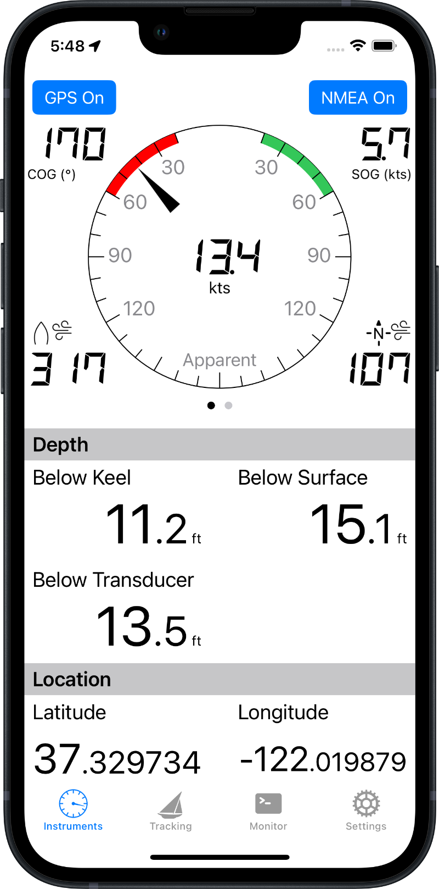
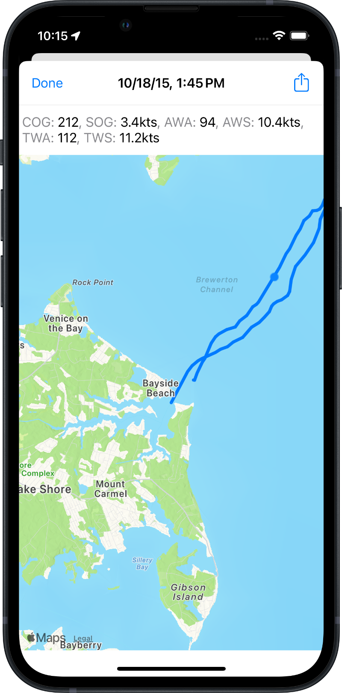
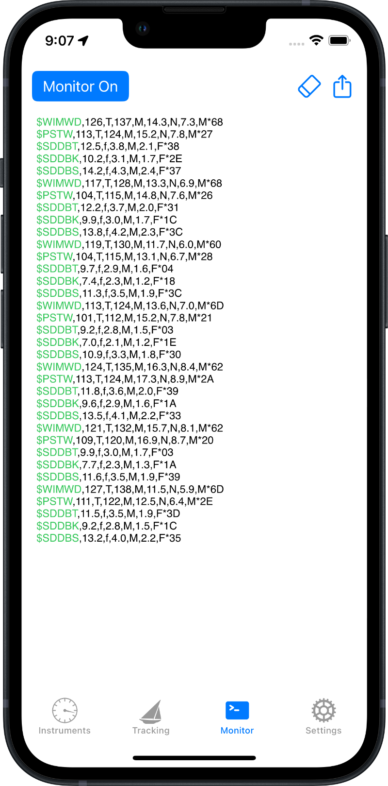
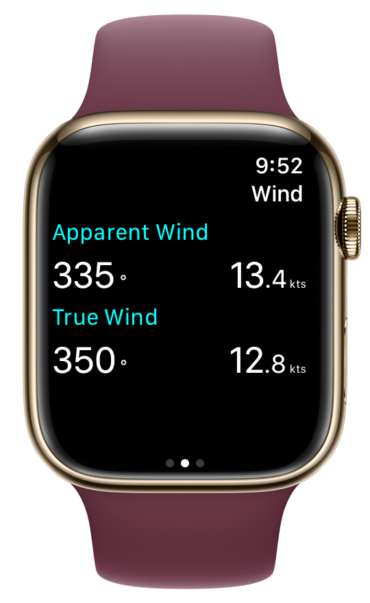

Sail Buddy is a light-weight sailing app designed to display navigation data in an easy-to-read, easy-to-use format.
It started out as a no-frills display for day sailing and short trips, but recent updates have added a lot more
power and sophistication while keeping the focus on simplicity, elegance and ease of use.

[][store]
{: .app-store :}

Large, easy to read format

Analog-style, multi-function displays

Display recorded data via maps

Dark mode support

Monitor, filter, and export raw NMEA data

 

Full Apple Watch support

Works great in split view on iPads; view instrument data alongside navigation charts

Sail Buddy is *not* a navigation app. There are [many][ex1] [other][ex2] [apps][ex3] that are better at navigation.
Sail Buddy focuses on data display in a super-easy-to-read format. On iPads, Sail Buddy can run
next to your favorite navigation app in split view.

#### What Sail Buddy does ####

* Displays course and speed in a large, easily read display
* Displays [NMEA data](#nmea) the same way: TCP and UDP connections are supported
* Monitors and displays all "raw" NMEA data on a [separate tab](#monitor). You can filter by NMEA code or export
  the raw data to assist in troubleshooting your setup.
* Route tracking with full capture of GPS and NMEA data (a feature I couldn't find in other apps). Saved trips can be viewed on
  a map or exported in CSV, KML (for Google maps), GPX/XML, JSON or GeoJSON formats
* Saved trips can be transferred between iOS devices that support AirDrop. Click the Share icon and choose
  "JSON (native)" format to transfer the trip
  to Sail Buddy running on a different device. This feature is nice for sharing trips with a friend, or viewing a trip on an iPad or larger display.
* iPhone, iPad and Apple Watch are all supported.

##### New in Version 4 #####

Version 4 is the biggest update yet! The entire app has been redesigned with great new features including:

* Much improved data table display. On larger and landscape orientations, the layout adjusts to make
  maximum use of space
* Analog display option lets you see course, speed and wind together in an integrated dial. Swipe left
  or right to toggle between apparent and true wind.
* Full support for "dark mode," which you can set in the Settings App (Display & Brightness) or in the control center.
* Satellite data is available if location is sourced from NMEA data. You can see satellite location,
  signal strength and status in the analog display.
* Completely redesigned Settings tab makes features more accessible and easier to understand, with
  improved inline help.

### Tell me what you think! ###

Sail Buddy is always evolving with lots of room for new ideas. I am very interested in making it more
useful so long as I can keep it fast and light. If you have ideas or are experiencing issues, please [contact me][contact].

### NMEA Operation ### {#nmea}

Sail Buddy can read and display instrument data transmitted in [NMEA 0183 format][nmea] over a TCP or UDP connection. Here are some typical setups:

#### WiFi ####

WiFi-based hardware such as the
[Brookhouse iMux][imux] multiplexer, the [SailTimer AirLink][airlink]  or the
[SailTimer wind vane][sailtimer1] (discontinued in 2013) create their own WiFi networks.

1. Go to iPhone settings and choose the wifi network created by your hardware
2. Launch Sail Buddy, go to Settings / Connection and enter the network settings for your hardware
3. Also enable the appropriate options under Hardware Support for your hardware
4. Tap the NMEA button in Sail Buddy's Instruments tab

##### SailTimer Wind Instrument #####

The [SailTimer wind instrument][sailtimer2] connects directly to your iPhone via [Bluetooth][bt] using a custom app.

1. Download the [SailTimer API][stapi] from the App Store
2. Launch the SailTimer API, connect to the wind instrument, and confirm it is receiving data
3. Launch Sail Buddy, go to Settings / Connection and enter these settings:
   * Connection Type: **UDP**
   * Port: **55554**
   * Select **SailTimer Wind Instrument**
4. In Settings / Display make sure **Wind Speed & Direction** is selected
5. Tap the NMEA button in Sail Buddy's Instruments tab

Sail Buddy supports the following NMEA sentences:

Category | Identifier | Definition
----     | ---------- | ----------
Location | ??GGA      | GPS Location (if location source is set to "NMEA Data")
Location | ??RMA      | Recommended minimum navigation information (if location source is set to "NMEA Data")
Location | ??RMC      | Recommended minimum navigation information (if location source is set to "NMEA Data")
Wind     | ??MWV      | Wind speed and angle
Wind     | ??MWD      | Wind direction and speed
Wind     | ??VWR      | Relative wind speed and angle
Wind     | PSTW       | Wind angle and speed. See [SailTimer wind instrument][sailtimer2]
Wind     | WIBAT      | Battery level (for [SailTimer wind vane][sailtimer1])
Depth    | ??DBT      | Depth below transducer
Depth    | ??DBK      | Depth below keel
Depth    | ??DBS      | Depth below surface
Depth    | ??DPT      | Depth (below surface or keel)
Satellite| ??GSA      | Active satellites (if location source is set to "NMEA Data")
Satellite| ??GSV      | Satellites in view (if location source is set to "NMEA Data")

If your device is not supported, please [contact me][contact] and I can try to add support in the next update.

**Notes:**

1. Sail Buddy can obtain your location either from your iPhone/iPad's built-in GPS (i.e., Location Services)
   or from your NMEA devices. The switch is in Settings / Data.
2. If you are reading NMEA data and run Sail Buddy in the background, you **must** turn on GPS even if you receive
   location and course/speed data from an NMEA device. This is because Sail Buddy uses your iPhone's Location Manager
   as a means to reliably get background processing time so it can read data connections.
   Also make sure you allow Sail Buddy constant access to your location, as set in
   the Settings app (even though Sail Buddy isn't actually using your location in this instance).
   None of this is necessary if Sail Buddy is always the active app, but most of us don't use our iPhones in that manner.
3. Previous versions of Sail Buddy gave you the option to display wind angle relative to either your current
   heading (default) or compass north. Version 4 eliminates that option and displays both. Wind angle(s) are
   relative to your current heading, while wind *direction(s)* are relative to compass north. Both apparent
   and true values are shown.

### Analog Wind & Satellite Displays ### {#analog}

{: .sidebar-image :}

You may choose to show wind and/or satellite data in an  analog-style multi-function display above the data table.
Go to Settings / Display and turn on "Use Analog Display." 
This option is enabled when you choose either of the "Wind Speed & Direction" or "Satellites" options above it. 
Sail Buddy will move the corresponding indicators to a visual display above or alongside
the data table. Course and speed will also move to the analog display.

If you choose to display analog wind data, the display will consist of instrument dials, one for apparent
wind and the other for true wind. Swipe left or right on the dial to switch between them.

{: .sidebar-image :}

Current satellites "in view" are shown on a separate dial that provides satellite location (compass north is at
the top), signal strength, and status. Satellites with a signal-to-noise ratio (SNR) above 40 are shown
in a green circle while those with an SNR between 25 and 40 are shown in a yellow circle. Below 25 is shown
in red. Active satellites, used to obtain a fix, are shown in boldface.

### NMEA Data Monitoring ### {#monitor}

The Monitor tab shows a running display of all incoming NMEA messages, even those that Sail Buddy
otherwise ignores. Use the button in the top left to turn the monitor on or off.
In Settings / Monitor you can choose whether to include timestamps or filter in or out select messsages.
The "Include Network Events" option can provide helpful information if you are having trouble connecting
or maintaining a consistent connection.

The display is color-coded by message status. Invalid messages appear in red
while messages that failed [checksum confirmation][checksum]
appear in orange. (You can disable checksum verification in Settings / Data).
The codes for NMEA sentences that Sail Buddy recognizes appear in green while
those it doesn't appear in blue.

You can export the NMEA monitor (the most recent 500 sentences) with the Share button in the upper right. Note the extra
"Mail to Publisher" option, which lets you email the data directly to me in case you are having technical issues.

### Apple Watch ### {#watch}

{: .sidebar-image.small :}

Sail Buddy for Apple Watch displays most of the same information as the iOS app.
Swipe left or right to switch between information types.

You can also control Sail Buddy via the watch, for instance, start/stop route tracking.
Force-press the display to access the menu.

### Troubleshooting ###

**Sail Buddy doesn't display NMEA data**

Check the following:

* Your NMEA device is turned on, sending data, and hasn't crashed
* Your iPhone is connected to your NMEA device's wifi network (if your device creates its own network), or your iPhone and
  your NMEA device are connected to the same network
* The NMEA button is "on" in the upper right corner of the Instruments tab in Sail Buddy
* Turn on the [Monitor tab](#monitor) and confirm that NMEA sentences are coming through correctly (the green-coded ones are those that Sail Buddy understands).
  If some sentences are orange that indicates [checksum][checksum] failure (the 2-character code after the asterisk at the end of each sentence).
  If your devices don't include checksums, you can disable this check in Settings / Data.
* Turn on "Include Network Events" in Settings / Monitor. The monitor will now include status and error messages
  when trying to connect to your network devices.
* Try receiving data in another NMEA app, or the device's native app if any. It's possible your devices
  aren't connected, aren't sending data, or the network settings are not correct in Sail Buddy's Settings tab.

**I get a network error when I turn on NMEA data**

* Your iPhone is not connected to your NMEA device's wifi network (if your device creates its own network),
  or your iPhone and your NMEA device are connected to the same network
* Check to make sure your iPhone is not in airplane mode
* Try turning off "Monitor Network Status" in Settings / Connection. This disables Sail Buddy's 
  default check for network availability, which may be incompatible with the custom hardware of some networks.

**I'm receiving some NMEA data, but not all wind indicators**

In certain cases Sail Buddy calculates some wind indicators using your boat's course and speed. These
indicators will not appear if your boat isn't moving, or Sail Buddy isn't receiving course and speed data
from the GPS or NMEA.

**Nope, none of that solves my problem**

Use the [monitor](#monitor) described previously to send me your data,
and I'll try to help you out.

### Privacy Policy ### {#privacy}

All personal information collected by Sail Buddy, including your location, data logs,
and any metadata you enter yourself, is only stored on your iOS
device. Sail Buddy does not interact with a data server (other than your own devices)
and does not access or store information remotely.

### Contact Information ### {#contact}

* [Send me an email][contact]
* [Visit my work site](https://potomacboatcraft.com)
* Follow me on [Facebook](https://facebook.com/potomacboatcraft) or [Instagram](https://instagram.com/potomacboatcraft)

[][store]
{: .app-store :}

[sailtimer1]: http://sailtimerwindvane.com
[sailtimer2]: http://www.sailtimerwind.com/sailbuddy
[airlink]:    http://www.sailtimerwind.com/airlink
[imux]:       http://brookhouseonline.com/imux.htm
[nmea]:       https://en.wikipedia.org/wiki/NMEA_0183
[contact]:    mailto:sailbuddyapp@gmail.com
[store]:      {{ site.app_store_download }}

[ex1]:   https://itunes.apple.com/us/app/inavx-marine-navigation-noaa/id286616280?mt=8
[ex2]:   https://itunes.apple.com/us/app/aqua-map-usa-pro-marine-gps/id700695449?mt=8
[ex3]:   https://itunes.apple.com/us/app/i-boating-gps-nautical-marine/id994992062?mt=8
[stapi]: https://itunes.apple.com/us/app/sailtimer-api/id959558893?mt=8

[bt]:    https://en.wikipedia.org/wiki/Bluetooth
[checksum]: https://rietman.wordpress.com/2008/09/25/how-to-calculate-the-nmea-checksum/
